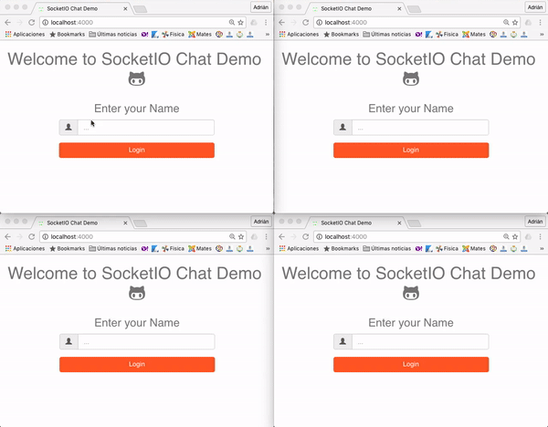

# SocketIOChatDemo

Web application developed to show a demo using *socket.io* library, built in *node.js* with *express* as framework for the back-end, and *HTML*, *CSS* and *JS* with *Bootstrap* in the front-end side.


## Demo



## Usage

```groovy
$ git clone https://github.com/ageapps/SocketIOChatDemo.git
$ cd SocketIOChatDemo
$ npm install
$ npm start
// connect in your browser to http://localhost:4000
```

## Resources

+ [socket.io]: Web Socket library
+ [node.js]: Server enviroment
+ [express]: Web application framework
+ [npm]: back-end package manager
+ [bower]: front-end package manager
+ [Bootstrap]: front-end framework
+ [jQuery]: front-end JS library


[socket.io]: http://socket.io
[node.js]:http://nodejs.org
[jQuery]:http://jquery.com
[nodemailer]:http://www.nodemailer.com/
[express]:http://expressjs.com
[bower]:http://bower.io
[Bootstrap]:http://getbootstrap.com
[npm]:https://www.npmjs.com
